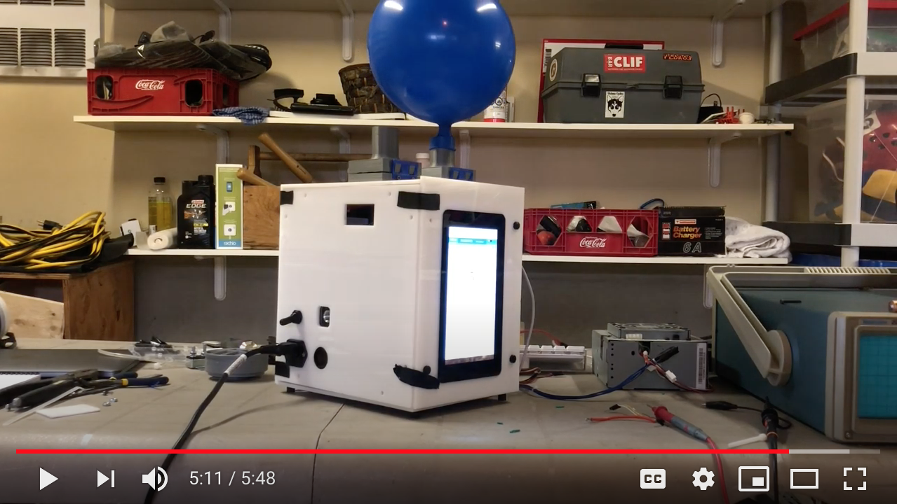

#  Breeze Ventilator
Welcome to our open-source, low-cost, easy-to-build ventilator design! We are a group of students, physicians and engineers who worked on the design to help alleviate the critical need for ventilators during the COVID-19 pandemic. Here is a [video](https://youtu.be/5ufh_80dSsk) with an overview of our design.

  

You can also check out our [in depth design video](https://youtu.be/dRpsoaCI0QA) and [public announcement video](https://youtu.be/4-jjhEgUjkQ)

## Folder Structure
Here is a breakdown of what you can find in each of the folders on our page:

1. Mechanical

Here you will find everything you need to construct the device including the bill of materials, the CAD files and the Assembly Guide.

2. Software

Here you will find all of our Breeze ventilator code which includes code for both the software and the firmware of the device. The firmware runes on an Arduino Mega wherease the Breeze interface runs on a Raspberry Pi 4. 

3- Electronics 

Here you will find the PCBs and the circuit diagrams. 

4- Documentation

Here you will find all of the documentation for operating the device such as the User Guide! 

We hope that you wil find inspiration from our design and that it will help you with your projects! 
