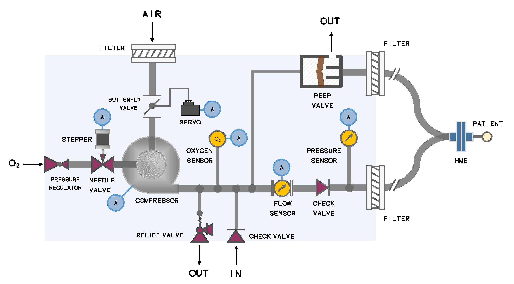

#  Breeze Ventilator
Welcome to our open-source, low-cost ventilator design! We are a group of students, physicians and engineers who worked on the design to help alleviate the critical need for ventilators during the COVID-19 pandemic.

Here is a [video](https://youtu.be/5ufh_80dSsk) with an overview of our design.

  

You can also check out our [in depth design video](https://youtu.be/dRpsoaCI0QA) and [public announcement video](https://youtu.be/4-jjhEgUjkQ).

## Operational Diagram

## Folder Structure
**Mechanical:** Everything you need to construct the device including the bill of materials and the CAD files.

**Software:** Breeze ventilator code including code for both the interface (running on the Raspberry Pi 4) and the firmware (running on the Arduino Mega).

**Electronics:** PCBs and the circuit diagrams.

**Documentation:** Documentation for operating the device including the User Guide and the Assembly guide, which will help you set-up and run your device smoothly.

## Conclusion

The Breeze Ventilator was built during a design sprint and is not ready to be safely used as a functioning ventilator. Nevertheless, we hope that you will find inspiration from our design and that it will help you with your projects! 

If you have any comments, questions or suggestions you can reach out to our team through raphael.hotter@mail.mcgill.ca

Good luck with your projects and happy creating! 
